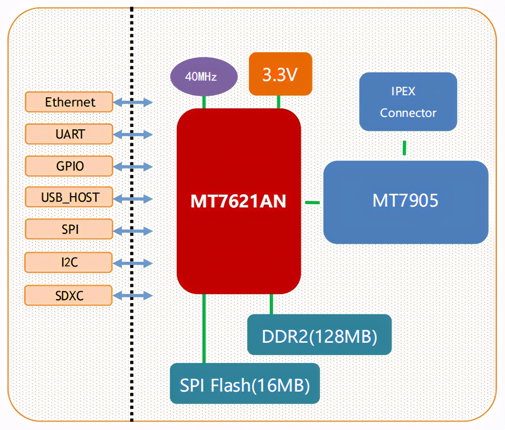

# louis's router tryout

1. WiFi6 千兆无线路由器开发板 RM60 5G 双频 WiFi 模块 OpenWrt 开发套件
   ¥ 399.00-419.00

   - https://detail.tmall.com/item.htm?spm=a230r.1.14.56.48b819419isThn&id=644027863410&ns=1&abbucket=14
   - https://www.hlktech.com/en/NewsInfo-175.html

   - MT7621 -> MT7621A (embedded 5p GbE Switch)
   - MT7905
   - MT7975

   - https://www.mediatek.com/products/homeNetworking/mt7621

   - WIFI
     - IEEE802.11
       - a
       - b
       - g
       - n
       - ac
         - https://en.wikipedia.org/wiki/IEEE_802.11ac-2013
       - ax
   - WIRED 　 IEEE802.3 / IEEE802.3u

   - 2G 5G
   - 14 - 22dBm

   

   - procs (factory claim):

     - 相容 IEEE 802.11 a/b/g/n/ac/ax
     - 专用的高性能 32-bit RISC CPU
     - 在 2.4 GHz 频带支持 20/40MHz 频宽和 5G 的 20/40/80MHZ 的带宽
     - 支持 2.4g/ 5.8 GHz 频段，数据速率高达 573+1201Mbps
     - 支持 STA/AP 两种工作模式
     - 内置 TCP/IP 协议栈
     - 支持无线升级（OTA
     - 3.3V 单电源供电
     - 模块尺寸 90mm×60mm，与其它模块相比不算小尺寸，这也是因为 HLK-RM60 集成了众多的功能。外置 4 个 I-PEX 天线座，丰富的硬件接口：UART、IIC、PWM、GPIO、 SPI，带两个 USB 接口，分别为 USB3.0、USB2.0；在数据持续发送下平均工作电流：800mA， 正常模式下平均：750mA。HLK-RM60 五千兆网口双串口，支持 2.4g&5.8 GHz 双频段，兼容多种协议，大大提升了带宽通道，新的技术解决了数据传输互相冲突，无序竞争的问题，能带给用户前所未有畅快体验。

   - usecase - 使用场景

     - ① 具有密集设备接入的场景，对带宽和时延的要求非常高，比如智能教室、大型场馆、体育馆、有大量的终端接入，而且上面有很多语音和视频的应用。

     - ②loT 的场景，在智能楼宇，包括一些智慧医院，可以通过 HLK-RM60 把 loT 的传感器把数据传回到网络中来。特别是在智慧医院的建设应用中，医疗器械及与医疗大数据之间的网络联接，海量且精准的数据查找，对速度与带宽都会有越来越高的要求。

     - ③ 一些关键应用的场景，包括一些自动化的设备，比如机器人的小车，HLK-RM60 可以对低时延的一些应用加以支持。

1. MT7620A 无线 WiFi 模块 4G 转 wifi 转网口转串口 物联网 openwrt 开发板

   - https://item.taobao.com/item.htm?spm=a230r.1.14.10.5b73503c331We7&id=641857358949&ns=1&abbucket=14#detail
   - EC20CEHDLG/4G 模块
   - MT7628 无线 WiFi 模块/WiFi 转串口转 4G 转有线网口/物联工控网关透传

   - Antenna:
     - 2T2R

1. openwrt 开发板 千兆路由器开发板 MT7621A 物联网智能网关开发套件

   - https://detail.tmall.com/item.htm?spm=a230r.1.14.29.605a19411WD0q8&id=624340705198&ns=1&abbucket=14&skuId=4590073606858

   - MT7621 -> MT7621A (embedded 5p GbE Switch)
   - MT7905
   - MT7975

   - 
   - 

- https://www.mediatek.com/products/homeNetworking/mt7620n-a
  - 2Gbps IP4 routing, NAT, NAPT
  - Wi-Fi 4 (n)
  - 2.4GHz
  - MT7620A:
    - Full function in TFBGA package
  - MT7620N:
    - N300 mainly in DRQFN package

1. wifi6 routers lineup

   - https://pic3.zhimg.com/v2-a5ea48a30e353ff2b96004ffdfd36bda_r.jpg

1. Table of Hardware: Ideal for OpenWrt + 802.11ax supported

   - https://openwrt.org/toh/views/toh_available_16128_ax-wifi

1. MTK 开发板千兆路由器开发 MT7621A 单片机智能网关 openwrt 二次开发

   - 

1. HLK-RM28E 5G WiFi 无线路由模块双频 1200M 性能稳定高速 wifi 传输
   - https://item.taobao.com/item.htm?spm=a230r.1.14.38.60886f6eXZSvuo&id=637832854848&ns=1&abbucket=14#detail

1. MT7621路由器开发板千兆网口openwrt提供源码定制定制通讯网关5G
   - https://item.taobao.com/item.htm?spm=a230r.1.14.40.155d301cfZln1F&id=613512526296&ns=1&abbucket=14#detail
   - 
   - 
   - 

1. 高通IPQ4019 1300Mwave2双频企业级双4G路由 OpenWrt三频 开发板
   - https://item.taobao.com/item.htm?spm=2013.1.w4004-17274861113.5.90132454sus0FO&id=591663477056
   - 
